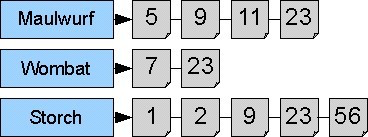
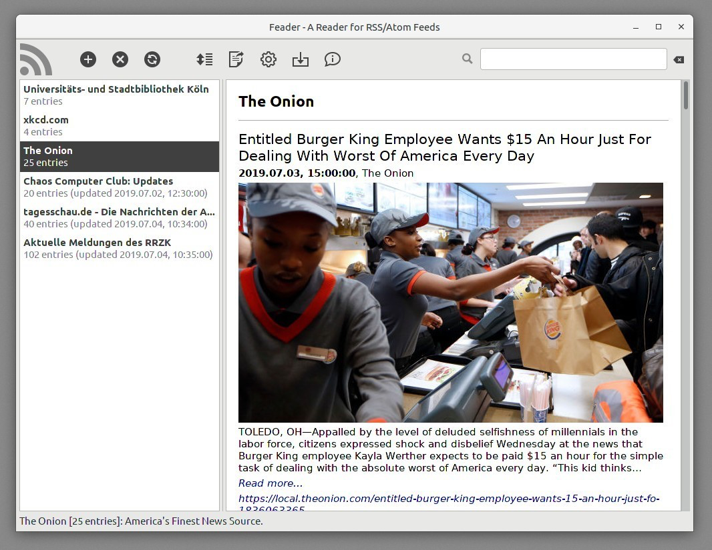
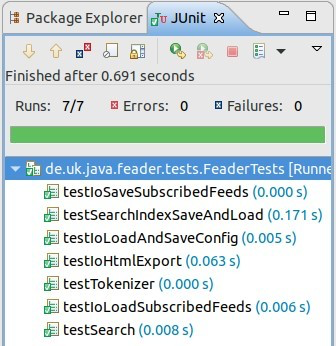

Gruppenteilnehmer: Alessandro Marini & Lukas Hoffmann
Ich: Lukas Hoffmann

# Allgemeine Informationen

Diese Prüfungsarbeit besteht aus zwei Anforderungen:

1. Implementation des Programms gemäß dieser Aufgabenstellung

2. Interne Dokumentation aller Klassen, Attribute und Methoden mit Javadoc. Evtl. ist eine zusätzliche Dokumentation innerhalb von Methodenkörpern (bspw. komplexere Algorithmen) sinnvoll (siehe auch Kapitel 4.5).

----

Die **Abgabe der Arbeit** besteht aus dem fertig bearbeiteten Projekt und erfolgt über den ILIAS-Kurs des Seminars bis spätestens 15.09.2022, 23:59 Uhr! Dort ist eine entsprechende Prüfung mit den Materialien angelegt:  [https://www.ilias.uni-koeln.de/ilias/goto_uk_exc_4780986.html](https://www.ilias.uni-koeln.de/ilias/goto_uk_exc_4780986.html)

WICHTIG: Die Abgabe erfolgt als ein .zip-Archiv! Bitte exportieren Sie Ihr Projekt aus Eclipse mit Rechtsklick auf den Projektordner → „Export…“ → „Archive File“ und benennen Sie das exportierte .zip-Archiv unbedingt nach folgendem Muster: <Matrikelnummer>-<UzK-Account>.zip, also z.B. 123456-nreiter2.zip! Eine Abgabe in anderer Form wird nicht akzeptiert!

----

Das Programm kann sich an den Vorschlägen in diesem Dokument orientieren, Sie können jedoch auch davon abweichen. In diesem Fall sollten Sie jedoch bei der Dokumentation besonders sorgfältig sein und Abweichungen von den Vorschlägen begründen. <ins>Zudem müssen unabhängig davon die verpflichtenden Anforderungen, die an das Programm ge stellt werden, in jedem Fall erfüllt sein</ins> (siehe auch Kapitel 4).

Gruppenarbeit ist möglich, allerdings mit maximal drei Teilnehmer:innen und lediglich bei der Programmierung, nicht bei der internen Dokumentation. Es sollte in diesem Fall im Code mit Hilfe von Kommentaren klar dokumentiert sein, wer welchen Programmteil bearbeitet hat. Außerdem muss die/der entsprechende Gruppenpartner:in in der README-Datei im Projekt angegeben sein.

Sie sollen mit dieser Arbeit beweisen, dass Sie der Programmiersprache Java mächtig sind. Das Programm muss in einem lauffähigen Zustand vorliegen, d.h. es muss a) ausführbar und funktionstüchtig sein und b) die mitgelieferten JUnit-Tests bestehen und die genannten Anforderungen an die Implementation erfüllen. Andernfalls gilt die Arbeit als nicht bestanden.

# Programmbeschreibung

Ihre Aufgabe ist es, einen Feed Reader für [RSS/Atom](https://de.wikipedia.org/wiki/Atom_(Format))-Feeds (fertig-) zu entwickeln und zu implementieren. Die noch fehlenden und von Ihnen zu erarbeitenden Teile der Anwendung umfassen dabei die Input/Output-Funktionen der Anwendung (inklusive HTML-Export), die eingebaute „Suchmaschine“, mit der die Feed-Inhalte durchsucht werden können, und zwei weitere Zusatzfunktionen, die zusammen mit den bereits genannten in Kapitel 4 genauer beschrieben sind.

## RSS/Atom Feed Reader als Desktopanwendung

Bei RSS und Atom handelt es sich um [Web-Feed](https://de.wikipedia.org/wiki/Web-Feed)-Formate, mit deren Hilfe Benutzer*innen einer Website (o.ä.) über Aktualisierungen von Inhalten informiert werden können. Die Daten werden in beiden Fällen in Form von XML-Dateien übermittelt, sind jedoch jeweils unterschiedlich strukturiert (die Interpretation der gelesenen Feed-Daten ist bereits fertig implementiert und somit nicht Teil der Aufgabe!). Die grundlegenden Elemente eines Web Feeds umfassen u.a. einen Titel, eine Beschreibung, das Datum der letzten Aktualisierung sowie eine Liste der Entries (Einträge) des Feeds. Diese Entries beinhalten wiederum jeweils Daten zu ihrem jeweiligen Titel, Veröffentlichungsdatum, dem eigentlichen Inhalt sowie einer URL zur Website, auf welcher der volle Inhalt, den der Entry beschreibt, verfügbar ist.

Um einen Web-Feed abonnieren zu können, wird ein Client-Programm (ein sog. Feed Reader) benötigt, über dessen Oberfläche möglichst komfortabel Feeds abonniert, gekündigt, durchsucht und gelesen werden können. Bei dem hier vorliegenden Projekt Feader handelt es sich um einen solchen Reader für Web Feeds.

Mit dieser Aufgabenstellung bekommen Sie eine graphische Benutzeroberfläche in Form einer Desktopanwendung ausgeliefert, welche die Kommunikation mit der/dem User*in steuert. Ihr Programm muss mit dieser mitgelieferten [GUI](https://de.wikipedia.org/wiki/Grafische_Benutzeroberfläche) über die vordefinierten Java-Interfaces kommunizieren. Selbstverständlich können Sie die GUI auch erweitern, wenn Sie noch weitere Funktionen umsetzen wollen (freiwillig!).

## Suchfunktion mit Invertiertem Index

Suchmaschinen sind Werkzeuge zur Recherche von Dokumenten, die in einem Computer oder einem Computernetzwerk gespeichert sind. Sie erstellen einen Schlüsselwort-Index für die Dokumentbasis, um Suchanfragen über Schlüsselwörter zu beantworten. Nach Eingabe eines Suchbegriffs liefert eine Suchmaschine eine Liste von Verweisen auf relevante Dokumente zurück. Dabei können verschiedene Suchverfahren Anwendung finden.

Eine Suchmaschine lässt sich auf viele verschiedene Arten realisieren, z.B. könnte man alle Dokumente „linear“ per `indexOf(term)` nach dem gesuchten Term durchsuchen, was eine sehr ineffiziente Variante wäre. Moderne Suchmaschinen sind in der Mehrzahl indexbasiert, was bedeutet, dass sie zunächst eine Datenstruktur erzeugen, die für

Suchanfragen konsultiert wird. Der momentane Industriestandard für eine solche Datenstruktur ist der invertierte Index.

Ein invertierter Index enthält das gesamte Vokabular der indexierten Dokumente (also alle in ihnen vorkommenden verschiedenen Wörter je ein mal, auch Types genannt). Jedes Wort ist dabei an eine Liste (o.ä.) geknüpft, in der alle Dokumente aufgelistet sind, in denen das Wort vorkommt (also deren Namen, Pfad o.ä. - nicht die gesamten Dokumente!).

Invertiert wird dieser Index deshalb genannt, weil nicht die Dokumente die in ihnen enthaltenen Wörter listen, sondern die Wörter die Dokumente, in denen sie vorkommen. Eine solche Dokumentenliste bezeichnet man auch als Postings List.

Folgende Abbildung zeigt vereinfacht einen invertierten Index. Links finden sich die Wörter (Types), rechts in einer Liste die Dokumente (hier mit Nummern unterschieden), in denen die entsprechenden Wörter vorkommen:

Um den Index nicht größer als notwendig werden zu lassen, wird gemeinhin darauf verzichtet, hochfrequente, aber semantisch arme Wörter wie Artikel und Präpositionen (sogenannte Stopwords) in den Index aufzunehmen. Sie sind nicht dazu gezwungen, in Ihrer Suchmaschine genauso zu verfahren, sie können es aber gerne so realisieren, quasi als fakultative Zusatzaufgabe.

# Informationen zur Vorlage

## Technische Voraussetzungen

Sowohl die mitgelieferte, lauffähige Demo-Anwendung, als auch die Programmier-Vorlage benötigen wegen der verwendeten externen Bibliotheken mindestens das Java JDK 8 (die volle Versionsnummer ist `1.8.x_xxx`). Die Projekte sind jedoch auf ein Compliance-Level von JDK 11 eingestellt. Sollten Sie eine ältere JDK-Version installiert haben, können Sie versuchen, das Compliance-Level in der Projektkonfiguration auf 1.8 herunter zu setzen. Achten Sie im Falle von mehreren verschiedenen installierten JDK-Versionen darauf, dass Eclipse das richtige JDK verwendet.

Wenn Sie die im Seminar vereinbarten Versionen nutzen, sollten keine Änderungen nötig sein.

## Import der Vorlage in Eclipse

Sie erhalten die beiden Java-Projekte `Feader-Demo` (eine lauffähige Demo des fertigen Programms) und `Feader-Vorlage` (die Projektvorlage, mit der Sie arbeiten sollen) in einer gemeinsamen .zip-Datei `Feader.zip`. Es empfiehlt sich der Übersichtlichkeit halber in Eclipse einen neuen Workspace für Ihre Arbeit anzulegen. Klicken Sie dazu im Menü unter `File → Switch Workspace` auf `Other...` und geben Sie einen neuen, leeren (oder nicht existierenden) Ordner als neuen Workspace an.

Entpacken Sie die zip-Datei zunächst. Danach können Sie `Feader-Demo` über `File → Import → Existing Projects into Workspace` und `Feader-Vorlage` über `File → Import → Existing Maven Projects` importieren.

## Start der Anwendung und Erläuterung der GUI

Sie können Ihre Anwendung einfach starten, indem Sie sie in Eclipse als Java-Application ausführen. Wählen Sie hierbei als Einstiegspunkt die Klasse Feader (sie enthält die main Methode). Natürlich wird ihr Programm nicht von Anfang an funktionieren, da Sie es ja erst noch fertig programmieren müssen. Um vorher schon einen Eindruck von der gewünschten Funktionsweise zu bekommen, sehen sie sich die Demo der Anwendung an (sie Kapitel 3.6).

Die Oberfläche des Programms ist eine Desktop-GUI (wie in der Abbildung zu sehen). Je nach dem, welches Betriebssystem Sie benutzen, kann das Aussehen der GUI von der Abbildung oben abweichen – es sollten jedoch alle Bedienelemente verfügbar sein und funktionieren.

Der Hauptbereich des Anwendungsfensters ist zweigeteilt: Die linke Spalte enthält die Titel aller abonnierten Feeds, die rechte Spalte zeigt den Inhalt des gerade ausgewählten Feeds an. Darunter wird - je nach Zustand der Anwendung – eine kurze Info-Zeile zum ausgewählten Feed oder ein Fortschrittsbalken zur Rückmeldung aktuell laufender Prozesse angezeigt (alle Feeds aktualisieren o.ä.).

Über dem zweigeteilten Hauptbereich des Fensters befindet sich die Toolbar, welche (von links nach rechts) folgende Elemente enthält:

1. Das Anwendungs-Logo (nicht klickbar)

2. Button zum Hinzufügen/Abonnieren eines neuen Feeds (URL wird bei Klick abgefragt)

3. Button zum Löschen/Abbestellen des ausgewählten Feeds

4. Button zum Aktualisieren aller abonnierten Feeds (neue Daten werden aus dem Internet geladen)

5. Button zum Sortieren der Feeds-Liste nach dem Datum der letzten Aktualisierung der Feeds (siehe Zusatzfunktionen unter 4.4)

6. Button zum Exportieren aller aktuell angezeigten Entries (Feed-Einträge) als HTMLDokument (siehe 4.1)

7. Button zum Öffnen der Anwendungs-Einstellungen

8. Button zum Hinzufügen/Abonnieren von Beispiel-Feeds aus der Datei feader.samples (diese Datei liegt Ihrem Projekt bereits bei) – diese Funktion soll Ihnen das Heraussuchen von Feed-Adressen zu Testzwecken abnehmen, aber natürlich können Sie auch eigene Feeds abonnieren

9. Button zum Einblenden einer (recht uninteressanten) „About“-Meldung

10. Rechts im Fenster: Suchfeld zum Eintippen eines Suchbegriffs (die Suche wird automatisch bei jedem Tastendruck ausgeführt! Siehe 4.3)

11. Button zum Zurücksetzen der Suche

## Projektstruktur

Das Projekt „Feader-Vorlage“ enthält folgende Verzeichnisse und Dateien:

- Ordner src/main/java enthält den Quellcode der Vorlage inklusive der von Ihnen zu implementierenden Interfaces. Fügen Sie hier eigene Klassen in geeignete Unterpackages hinzu.

- Ordner src/main/resources enthält Programm-Ressourcen, die für die Ausführung benötigt werden. In diesem Fall handelt es sich um die Icon-Grafiken, die in der GUI dargestellt werden.

- Ordner `src/test/java` enthält die JUnit-Tests, die Ihr Programm „bestehen“ muss (siehe auch 4.1).

- Ordner `src/test/resources` enthält Ressourcen, die von den JUnit-Tests benötigt werden. Hierbei handelt es sich um eine `.rss`-Datei, die als Quelle für Testdaten genutzt wird.

- Ordner `logs` ist der Ordner, in den die Anwendung ihre Log-Dateien schreibt

- Datei `feader.config` enthält die Konfiguration der Anwendung. Diese Datei wird beim Speichern einer veränderten Konfiguration (über den Settings-Dialog) überschrieben.

- Datei `feader.samples` enthält URLs zu RSS/Atom-Feeds, die zu Testzwecken benutzt werden können. Diese Feeds werden abonniert, wenn man im Programm auf den Button „Add Sample Feeds“ klickt (siehe 3.3).

- Dateien `feader.feeds` und `feader.index` enthalten jeweils die Daten zu den abonnierten Feeds (damit sind alle Daten gemeint, also auch die gesamten Inhalte wie Titel, Text, ...) und den Suchindex. Diese Dateien existieren vor dem ersten Programmstart noch nicht. Sie werden (wenn Ihre Implementation funktioniert) von der Anwendung angelegt und beim Beenden immer wieder aktualisiert.

## Junit-Tests

Sie können die Unit Tests jederzeit ausführen, indem Sie mit der rechten Maustaste auf den Projektordner und dann auf `Run As... → JUnit Test` klicken. Alle Tests sind bestanden, wenn das Ergebnis folgendermaßen aussieht:

Bevor alles funktioniert, werden die Tests entweder überhaupt nicht ausgeführt (etwa weil Ihre Implementationen noch nicht existieren und es eine `NullPointerException` gibt), oder sie schlagen fehl (was sich in einem roten statt grünen Balken äußert).

## Schnittstelle zwischen Vorlage und Ihrem Programmcode

Die Schnittstelle, über die Ihr Programm und die graphische Benutzeroberfläche kommunizieren, besteht (mit Ausnahme der Sortierfunktion, siehe unten) aus den Interfaces `IAppIO`, `ISearchEngine`  und `ITokenizer`.

Diese Interfaces müssen Sie in eigenen Klassen implementieren, damit das Programm funktioniert. Die genauen Anforderungen der Interfaces sind durch die deklarierten Methoden und die Javadoc-Kommentare spezifiziert.

Zunächst werden Instanzen Ihrer Implementationen der Interfaces erzeugt und dann von der bestehenden Anwendung verwendet. Zum Beispiel wird beim Programmstart die  `loadSearchIndex`-Methode und beim Beenden die `saveSearchIndex`-Methode von `ISearchEngine` aufgerufen. Alle weiteren Aufrufe von `ISearchEngine`-Methoden sind abhängig von den Benutzeraktionen (oder den jeweiligen JUnit-Tests). Damit gefundene Feed-Entries sowie deren Inhalte in der Anwendung dargestellt werden können, muss die `search`-Methode von `ISearchEngine` eine Liste von `Entry`-Objekten zurückgeben.

Damit Ihre Implementationen der Interfaces im Hauptprogramm und in den JUnit-Tests genutzt werden, müssen Sie in der Klasse `Feader` (welche die `main`-Methode des Programms enthält) die entsprechenden Methoden `getSearchEngine()`, `getAppIO()` und `getTokenizer()` so anpassen, dass jeweils eine Instanz Ihrer eigenen Implementation zurückgegeben wird. Da diese Methode auch vom JUnit-Test aufgerufen wird, müssen Sie für die Tests keine weitere Änderung durchführen.

Es folgt eine kurze Übersicht über die Aufgaben der drei Interfaces (die genauen Beschreibungen der Methoden sind - wie bereits erwähnt - in den Javadoc-Kommentaren zu finden):

- `IAppIO` definiert eine Klasse, die sich um alle Input-/Output-Funktionen der Anwendung kümmert. Ausgenommen sind das Speichern und Laden des Such-Index, denn dafür gibt es Methoden in ISearchEngine. Das bedeutet aber nicht, dass Sie diese Logik nicht in Ihre Implementation von IAppIO verlagern und sie dann aus der Suchmaschinen-Klasse heraus aufrufen können!

- `ISearchEngine` definiert die Klasse Ihrer Suchmaschine. Die zu implementierenden Methoden sind in den Javadoc-Kommentaren des Interfaces sehr ausführlich beschrieben.

- `ITokenizer` definiert einen einfachen Tokenizer mit nur einer Methode `tokenize`, welche die Aufgabe hat, einen Text in einzelne Tokens (in diesem Fall sind das Wörter) zu zerlegen (siehe auch 4.1). Die Implementation Ihres Tokenizers wird mittels der Methode `setTokenizer()` automatisch an Ihre `SearchEngine`-Klasse übergeben, sodass sie den Tokenizer für Ihren Indexierungsvorgang nutzen können.

## Demo-Version zur Veranschaulichung der Funktionalität

Dem Projekt liegt eine lauffähige, fertig implementierte Demo-Version bei (Projekt `FeaderDemo`), damit Sie eine Vorstellung von der zu erzielenden Funktionalität bekommen.

Um die Demo auszuführen, starten Sie sie in Eclipse über die Klasse `FeaderDemo`.

# Spezifikation der Anforderungen

In diesem Kapitel finden Sie nähere Informationen zu den Anforderungen an Ihre Hausarbeit.

## Implementierung und JUnit-Tests

Ihr Programm muss alle mitgelieferten JUnit-Tests aus der Test-Klasse `FeaderTests` (in `src/test/java/...`) bestehen, d.h. die Ausführung muss in einem grünen Balken in Eclipse resultieren. Mit Hilfe dieser Tests können Sie auch überprüfen, ob es Grundsätzliche Probleme mit Ihrem Programm gibt.

**Es gelten neben dem Bestehen der Tests folgende Anforderungen, die nicht durch die Tests überprüft werden**:

- Ihr Programm muss über die definierten Schnittstellen mit der mitgelieferten GUI interagieren (das tun sie automatisch, wenn sie alle Methoden der Interfaces implementieren). Ihnen steht dabei frei, die GUI weiter auszubauen.

- Sie müssen einen invertierten Index aufbauen und für Ihre Suchanfragen nutzen. Suchmaschinen, die lediglich Operationen über Strings wie `indexOf(Suchterm)` vornehmen, werden nicht akzeptiert.

- Zusatzfunktion 1: Ihre Suchmaschine unterstützt eine Wildcard-Suche (siehe 4.4.1).

- Zusatzfunktion 2: Die GUI-Toolbar erhält einen zusätzlichen Button, über den sich die Feeds-Liste sortieren lässt (siehe 4.4.2).

## Verwaltung des Indexes

Bei der Indexierung von Texten muss auf einige Details geachtet werden:

- Tokenisierung: Die Vorlage nutzt ein einfaches Wortmodell: Wörter sind Abfolgen von Buchstaben. Sie können für das Auftrennen von Texten in Wörter in Ihrer Implementation von `ITokenizer` einen regulären Ausdruck nutzen, Sie können aber auch ganz anders vorgehen – Hauptsache ist, dass das Ergebnis stimmt!

- Indexierung: Im Index finden sich standardmäßig alle Wörter in Kleinschreibung. Dies sollte in Ihrer Umsetzung auch der Fall sein.

- Suche im Index: Achten Sie beim Bearbeiten der Suchanfragen (`search()` Methode) darauf, auch den vom User eingegebenen Suchbegriff entsprechend in Kleinschreibung zu verwenden, bzw. diese genau so wie die indexierten Texte „vorzubehandeln“!

- Index serialisieren/deserialisieren: Um zu vermeiden, dass der Index bei jedem Programmstart neu erstellt werden muss, soll er beim Beenden des Programms in eine Datei serialisiert werden. Entsprechend muss beim Start des Programms überprüft werden, ob evtl. ein serialisierter Index besteht, der eingelesen werden kann (`loadSearchIndex()`-Methode in `ISearchEngine`). Außerdem sollte der Index beim Beenden der Anwendung gespeichert werden (`saveSearchIndex()`-Methode in `ISearchEngine`).

## Suchfunktion

Es genügt hier eine einfache Suche nach einzelnen Wörtern. Eine Mehrwort- oder Phrasensuche ist nicht gefordert. Bitte beachten Sie, dass ein Dokument (im Sinne eines Suchergebnisses) im Falle dieser Anwendung ein `Entry`-Objekt ist. Die `Entry`-Objekte eines Feeds erhält man über die Methode `getEntries()` der `Feed`-Objekte.

## Erweiterungen

### Wildcard-Suche

Erweitern sie Ihre Suchmaschinen-Implementation so, dass eine Wildcard-Suche (Platzhalter) möglich wird. Es sollten dann z.B. folgende Suchen die entsprechenden Tokens finden:

| Suche | Gefundene Tokens                   |
| ----- | ---------------------------------- |
| ei*   | ein, eine, Ei, Eis, eigentlich, …  |
| *at   | Salat, Etat, Spagat, Surrogat, …   |
| e*n   |  einen, eigenen, Eisen, erleben, … |

Es gibt sicherlich ganz wundervoll elegante und effektive Strategien, um eine Suche mit invertiertem Index auch für Wildcards möglich zu machen. Es reicht aber ausdrücklich auch eine einfache, „naive“ Lösung (lineare Suche nach passenden Einträgen im Index). Einzige Bedingung ist, dass die Lösung funktioniert und immernoch den selben invertierten Index als Suchstruktur benutzt! Achten Sie auch darauf, dass die (potenziell langsamere) Wildcard-Suche auch nur dann zum Einsatz kommt, wenn sich wirklich Wildcards (`*`) im Such-String befinden!

### Sortier-Funktion für abonnierte Feeds

Diese Aufgabe ist im Prinzip nicht sehr schwierig, allerdings erfordert sie ein Eingreifen in den bestehenden Quelltext der restlichen Anwendung. Die Herausforderung liegt hier also im Verständnis des Codes der Anwendung und dem Finden der richtigen Stellen zum „Einhaken“ der neuen Funktion.

Das Ziel ist ein Button in der Toolbar, der beim Klick die Feeds-Liste nach Update-Datum sortiert (siehe Demo-Projekt!). Ein wichtiger Hinweis und möglicher Ausgangspunkt für die Umsetzung ist die bereits fertig vorbereitete Klasse `SortableListModel`. Bisher verwendet die Feeds-Liste in der GUI zur Repräsentation der Listen-Daten die Klasse `CustomListModel`, die allerdings keine Sortierfunktion anbietet. Wenn stattdessen ein `SortableListModel` verwendet wird (die Klassen sind in diese Richtung einfach austauschbar), dann lässt sich für den Button die `sort()`-Methode von `SortableListModel` nutzen. Allerdings sind dann noch weitere Anpassungen des Programms nötig. Und wie bekommt man eigentlich einen funktionierenden Button in die Anwendung? Genau das ist Gegenstand dieser Zusatzaufgabe.

## Javadoc: Vorlage und Anforderung

Die Klassen der Vorlage sind mit Javadoc kommentiert. Sie müssen die von Ihnen angelegten Klassen ebenfalls dokumentieren. Evtl. ist es jedoch nicht notwendig, wirklich jede einzelne Methode zu kommentieren – beachten Sie aber folgende Anforderungen:

- Alle Methoden und Variablen, die nicht als private markiert sind, müssen dokumentiert werden, inkl. der Parameter (`@param`), Rückgabewerte (`@returns`) und eventueller Exceptions (`@throws`).

- Methoden mit geringerer Sichtbarkeit müssen dokumentiert werden, wenn sich die Funktionalität nicht ohne weiteres erschließt, oder wenn bestimmte Anforderungen an die Parameter gestellt werden (`X` darf nicht `null` sein, String darf keine Leerzeichen enthalten o.ä.). Dies bedeutet umgekehrt, dass Sie umso weniger kommentieren müssen, je mehr Methoden und Variablen Sie `private` deklarieren, und je besser Sie die Namen der Methoden/Variablen wählen (`String s` muss in jedem Fall dokumentiert werden, `String currentWord` nicht unbedingt).

# Tipps zur Vorgehensweise

Die nachfolgenden Erläuterungen sind lediglich Hinweise, wie das komplexe Problem „Suchmaschine“ angegangen werden kann. Sie können diese Überlegungen einfach ignorieren und ein eigenes Design entwerfen, allerdings müssen Sie die oben (Kapitel 4) spezifizierten Anforderungen (Bestehen der JUnit-Tests, Nutzung eines Invertierten Index, Bedienung der von der GUI geforderten Schnittstellen) sämtlich erfüllen.

## Vorbereitung

Auch wenn es vielleicht etwas trivial klingt: Überlegen Sie, wie Sie ein Problem lösen können, vielleicht auch ohne Computer, sondern mit Zettel und Stift. Versuchen Sie, das Problem zunächst grob zu umschreiben und versuchen Sie dann, einzelne Teilprobleme darin ausfindig zu machen. Dann können Sie diese Strategie rekursiv auf die Teilprobleme anwenden, bis Sie schließlich feststellen, dass Sie nur eine relativ große Menge von einfachen Problemen lösen müssen.

## Code-Hygiene

Es ist kein guter Stil, alle Funktionalität in einer Klasse zu implementieren, auch wenn das Interface `ISearchEngine` dies suggerieren mag. Klassen, die mehr als 300 Zeilen Code enthalten, sollten vermieden werden – stattdessen bietet es sich an, Aufgaben aufzuteilen und an Hilfsobjekte – auch Komponenten genannt – zu delegieren. Ähnliches gilt auch für Methoden – hier gilt als Richtwert 40 Zeilen, die nicht überschritten werden sollten.

Versuchen Sie also auch hier, eine Funktionalität in Teilfunktionen zu zerlegen. Natürlich sind dies lediglich Richtwerte, Sie sollten jedoch versuchen, sich an diesen zu orientieren, Abweichungen zu vermeiden und zu begründen.

Nutzen Sie außerdem nach Belieben die Möglichkeit, eigene Pakete anzulegen und so Ihr Programm weiter zu strukturieren.

## Verwaltete Daten einer Suchmaschine

Der in Kapitel 2.2 vorgestellte invertierte Index enthält nur die Information, welche Wörter in welchen Entries enthalten sind, nicht aber den gesamten Text! Versuchen Sie sich, bevor Sie mit dem Programmieren anfangen, zunächst einige Gedanken dazu zu machen, wie man einen solchen invertierten Index umsetzen könnte – im Zweifel tatsächlich mit Stift und Papier.

# Noch Fragen?

Sie können sich mit Verständnisfragen gern an den/die Dozent*in des Seminars oder Ihrer Übung wenden!